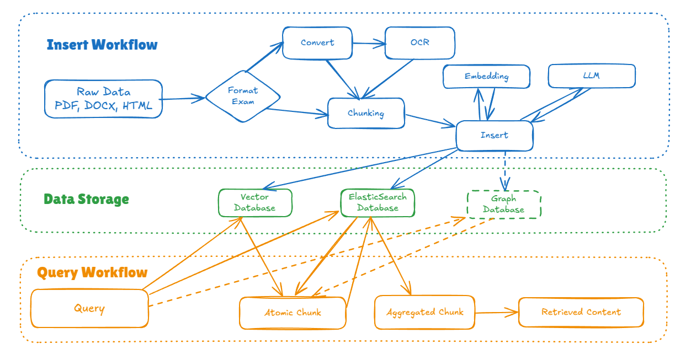

# cheap-RAG
A cheap but strong RAG framework.


## Workflow
### Collection Level Operation
- Create of data collections, indices
- Query for collection level
- Drop colllection

### Data Level Operation
There are two main workflow for data level operation:
- Insert workflow
- Query workflow



## GPU extras
The inference can be accelerated by Nvidia GPU hardware with TensorRT.

### Install system dependencies
**(Optional)**: If using docker container, please intall [nvidia-container-toolkit](https://docs.nvidia.com/datacenter/cloud-native/container-toolkit/latest/install-guide.html) first.

1. [Install CUDA](https://developer.nvidia.com/cuda-toolkit-archive) according to the CUDA installation instructions.
2. [Download](https://docs.nvidia.com/deeplearning/tensorrt/latest/installing-tensorrt/installing.html#download) the TensorRT local repo file that matches the Ubuntu version and CPU architecture you are using.
3. Install TensorRT from the Debian local repo package. Replace ubuntuxx04, 10.x.x, and cuda-x.x with your specific OS, TensorRT, and CUDA versions. For ARM SBSA and JetPack users, replace amd64 with arm64. JetPack users also need to replace nv-tensorrt-local-repo with nv-tensorrt-local-tegra-repo.
```
os="ubuntuxx04"
tag="10.x.x-cuda-x.x"
sudo dpkg -i nv-tensorrt-local-repo-${os}-${tag}_1.0-1_amd64.deb
sudo cp /var/nv-tensorrt-local-repo-${os}-${tag}/*-keyring.gpg /usr/share/keyrings/
sudo apt-get update
sudo apt-get install tensorrt
```